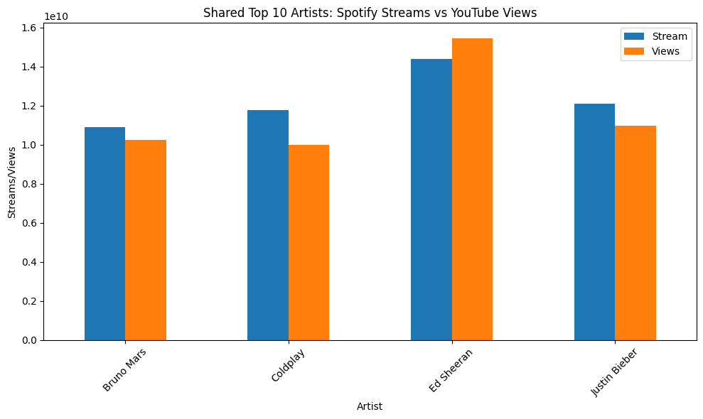
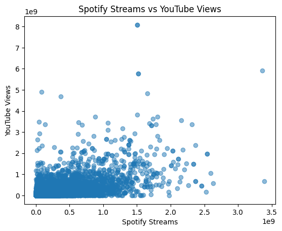
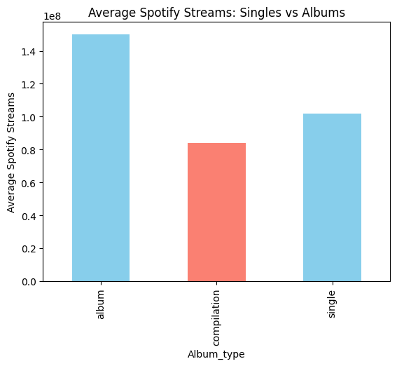
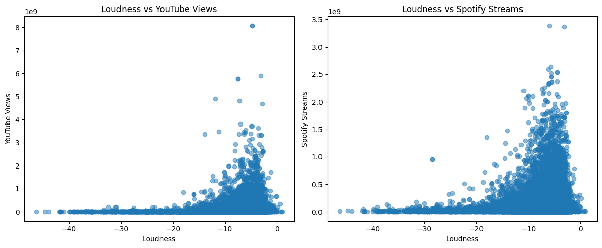
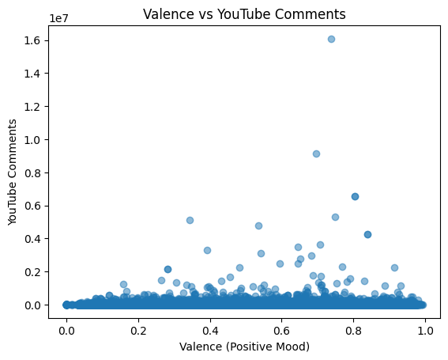
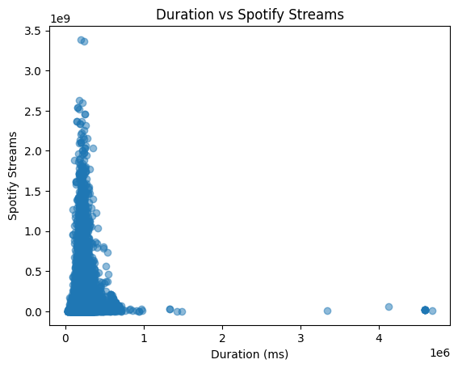
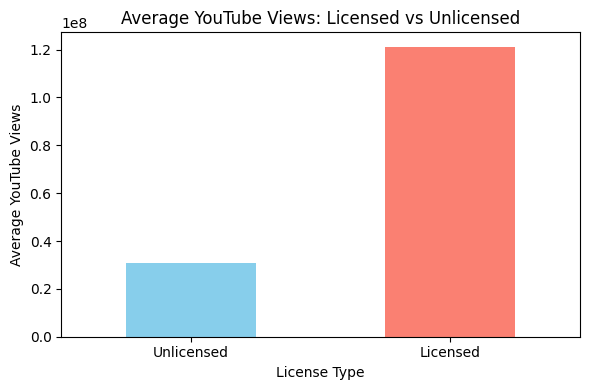
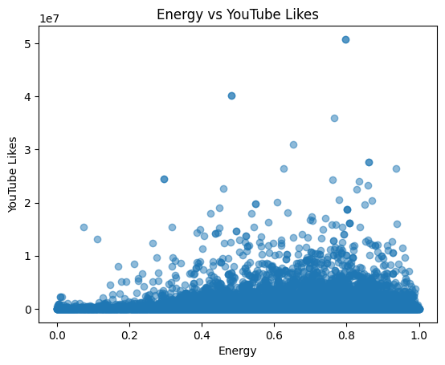
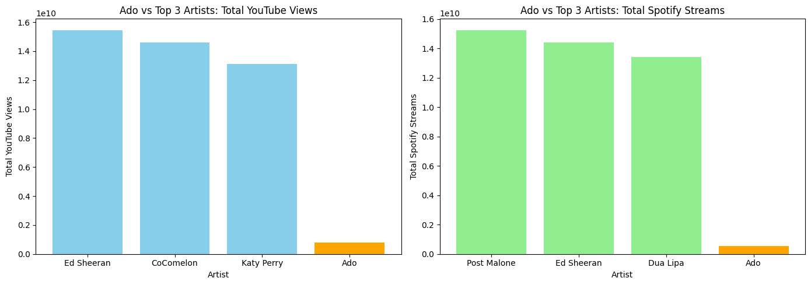
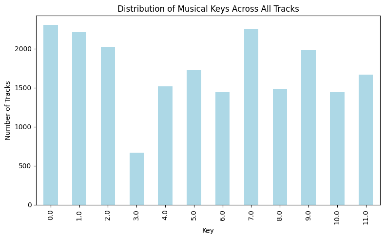

## async-final-project-gray-Matthew

## Dataset
[Spotify-YouTube Data](https://www.kaggle.com/datasets/rohitgrewal/spotify-youtube-data)

## Why did I chose this dataset?

[Honestly, I chose it because I found myself able to ask questions based on the data quite easily. Plus, I listen to music a lot using both YouTube and Spotify, depending on where I am. Having questions like “which top artists do these platforms have in common?” or “how high up is Ado on both platforms?” and having the ability to answer them with this dataset is a big reason in why I chose it!]

## Progress
- [x] Picked dataset
- [x] Defined 10 questions
- [x] Answered 10 questions using Pandas
- [x] Added at least one data visualization (using Matplotlib and/or Seaborn) to each single question
- [ ] Prepared presentation slides to present at graduation

## Questions
- [x] Question 1: "Which of the top 10 artists from each platform do both platforms share?"
  - Answer: "Both platforms share Ed Sheeran, Coldplay, Justin Bieber, and Bruno Mars."
  - Visualization: 

- [x] Question 2: "Is there a correlation between Spotify streams and YouTube views for each track?"
  - Answer: "There is a positive correlation between streams and views, as when Spotify streams increase for a track, its YouTube views usually increase too."
  - Visualization: 

- [x] Question 3: "Are singles streamed more on Spotify, on average, than songs from albums or vice versa?"
  - Answer: "Albums are streamed more on Spotify on average."
  - Visualization: 

- [x] Question 4: "Are tracks with louder average volume (higher Loudness) less popular on YouTube in terms of views and Spotify in terms of streams?"
  - Answer: "The volume of a track doesn't have much effect on its YouTube views nor Spotify streams."
  - Visualization: 

- [x] Question 5: "Do songs with higher valence (more positive mood) get more comments on YouTube?"
  - Answer: "It doesn't look like a song's valence has much impact on the number of comments it gets on YouTube.
  - Visualization: 

- [x] Question 6: "Do tracks with longer durations in milliseconds receive more Spotify streams?"
  - Answer: "No, tracks with longer durations do not receive more Spotify streams. It seems that the longer a track is, it gets slightly fewer streams."
  - Visualization: 

- [x] Question 7: "Do licensed videos receive more YouTube views than unlicensed ones?"
  - Answer: "Yes, licensed videos receive more YouTube views on average than unlicensed ones."
  - Visualization: 

- [x] Question 8: "Do songs with higher energy levels receive more likes on YouTube?"
  - Answer: "It doesn't look like the energy level of a song has much effect on how many likes it has on YouTube."
  - Visualization: 

- [x] Question 9: "How high up is Ado on Spotify and YouTube?"
  - Answer: "Ado's is ranked 640 on YouTube and 1311 on Spotify."
  - Visualization: 

- [x] Question 10: "Which key is most commonly used across all tracks in the dataset?"
  - Answer: "The most commonly used key is 0.0."
  - Visualization: 
